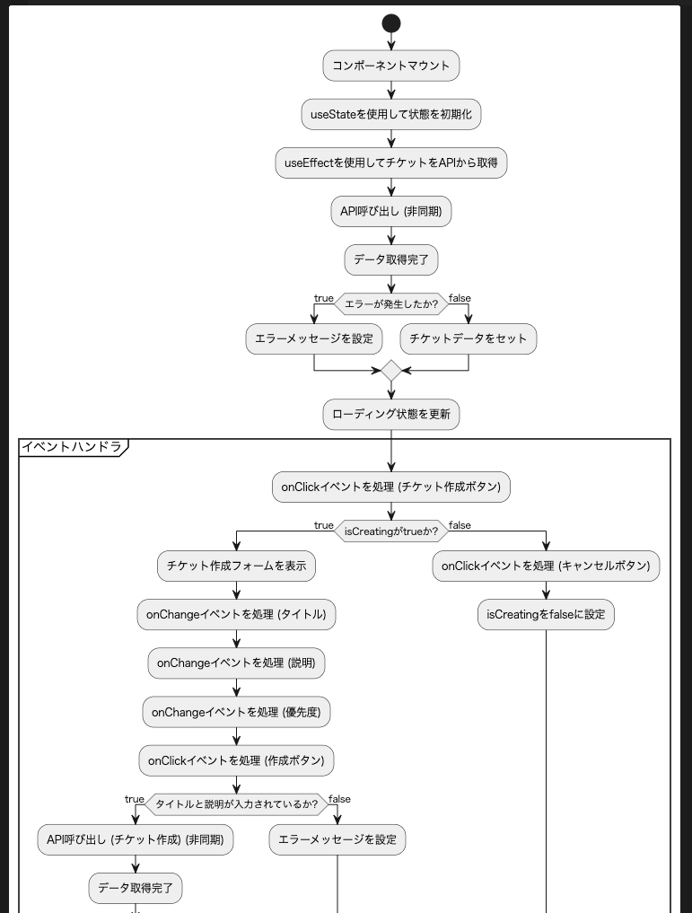

# UML Document Generator

## 📝 概要

このツールは、LLMを使用して**React**,**Vue**のコードからPlantUMLの図とマークダウンドキュメントを自動生成するCLIツールです。
指定したフォルダ内の`tsx`, `jsx`, `vue`ファイルを解析し、それぞれの図を生成します。

LLMを使用しているため、コードの構造によっては正しく図が生成されない場合があります。また、出力の一定性を保証するものではありません。
それでも皆様の一助となれば幸いです！

### サポートしているLLM
- OpenAI
- Anthropic
- OLLama1(デフォルトのURLの`http://localhost:11434`)

## 📊 生成する図

- 状態遷移図
- アクティビティ図
- シーケンス図
- マークダウンドキュメント

### シーケンス図


### アクティビティ図


### 状態遷移図


## 動作環境

下記の環境で動作確認を行なっております。
他の環境で動作しない場合は、issueよりお知らせください。

#### OS
- macOS Sequoia 15.1

#### ミドルウェア/言語
- Node.js: 23.2.0
- Java: 23.0.1(Temurin)
- Graphviz: 12.2.0

> **注意:** Java, GraphvizはPlantUMLの図を表示するために必要です。

## 💡 使用方法

```bash
# インストール
npm install uml-document-generator -g

# 実行
uml-document-generator -i <入力ディレクトリ> -o <出力ディレクトリ> -f <フレームワーク> --openai-key <OpenAI APIキー>
```

または

```bash
npx uml-document-generator -i <入力ディレクトリ> -o <出力ディレクトリ> -f <フレームワーク> --openai-key <OpenAI APIキー>
```

## 使用例

### React プロジェクトの場合

```bash
# インストール
npm install uml-document-generator -g

# 実行
uml-document-generator -i ./src -o ./output -f react --openai-key hogehoge
```

### Vue プロジェクトの場合

```bash
# インストール
npm install uml-document-generator -g

# 実行
uml-document-generator -i ./src -o ./output -f vue --openai-key hogehoge
```

## 📋 オプション

| オプション | 説明 | 必須 | デフォルト値 |
|------------|------|------|--------------|
| `-i, --input <path>` | React,Vueファイルのディレクトリパス | ✅ | - |
| `-o, --output <path>` | UMLファイルの出力ディレクトリ | ❌ | `./uml` |
| `-f, --framework <type>` | 使用するフレームワーク（reactまたはvue） | ✅ | - |
| `-s, --service <type>` | 使用するAIサービス（openaiまたはclaudeまたはollama） | ❌ | `openai` |
| `-m, --model <model>` | 使用するモデル | ❌ | openai: `gpt-4o-mini`<br>claude: `claude-3.5-sonnet-20241022`<br>ollama: `llama3.1` |
| `--openai-key <key>` | OpenAI APIキー（環境変数 OPENAI_API_KEY でも設定可能） | ❌ | - |
| `--claude-key <key>` | Claude APIキー（環境変数 ANTHROPIC_API_KEY でも設定可能） | ❌ | - |
| `--env <path>` | 環境変数ファイルのパス | ❌ | `.env` |

## 🔑 環境変数
プロジェクトのルートディレクトリに`.env`ファイルを作成し、以下のように環境変数を設定することで、APIキーを環境変数で設定することができます。
環境変数とオプションの両方で設定した場合は環境変数の方が優先されます。

```
OPENAI_API_KEY=your_api_key_here
ANTHROPIC_API_KEY=your_api_key_here
```

## 📁 生成されるファイル/ディレクトリ
outputディレクトリに生成されたファイルは、inputディレクトリのファイルと同じディレクトリ構造になります。

### 例

```
input/  
├── サブディレクトリ1/  
│　　├── ファイルA.tsx  
│　　└── ファイルB.tsx  
├── サブディレクトリ2/  
│　　└── ファイルC.tsx  
└── ファイルD.tsx  
```

```
output/  
├── サブディレクトリ1/  
│　　├── ファイルA.tsx  
│　　└── ファイルB.tsx  
├── サブディレクトリ2/  
│　　└── ファイルC.tsx  
└── ファイルD.tsx  
```

生成されるファイルの命名規則は以下の通りです。

- <ファイル名>.markdown.md
- <ファイル名>.activity.puml
- <ファイル名>.state.puml
- <ファイル名>.sequence.puml

## 💰 価格試算
OpenAIのAPIを使用し、`gpt-4o-mini`を使用した場合、
700行程度のコードで0.01ドル≒1円の消費が確認できました。

## 🚫 制限事項
1. モデルに応じて1回のAPI呼び出しで処理できるコードの量に制限があります。数千行単位のコードは途中で出力が途切れる可能性があります。
2. 複雑なコンポーネントの場合、生成される図が見づらくなる可能性があります
3. フレームワーク固有の機能やカスタムフックの解析は限定的です
4. Ollamaの1bモデルなど、サイズが小さいモデルを使用する場合、生成される図が不安定になります。

## 🔧 トラブルシューティング

### よくあるエラー
1. APIキー関連のエラー
   - 環境変数が正しく設定されているか確認してください
   - APIキーの有効期限が切れていないか確認してください

2. 出力エラー
   - 出力ディレクトリへの書き込み権限があるか確認してください
   - ディスク容量が十分にあるか確認してください

3. Graphvizエラー
   - Graphvizが正しくインストールされているか確認してください
   - システムのPATHに追加されているか確認してください

## 📄 ライセンス

MIT

## 🤝 貢献について

プルリクエストや課題の報告を歓迎します。
